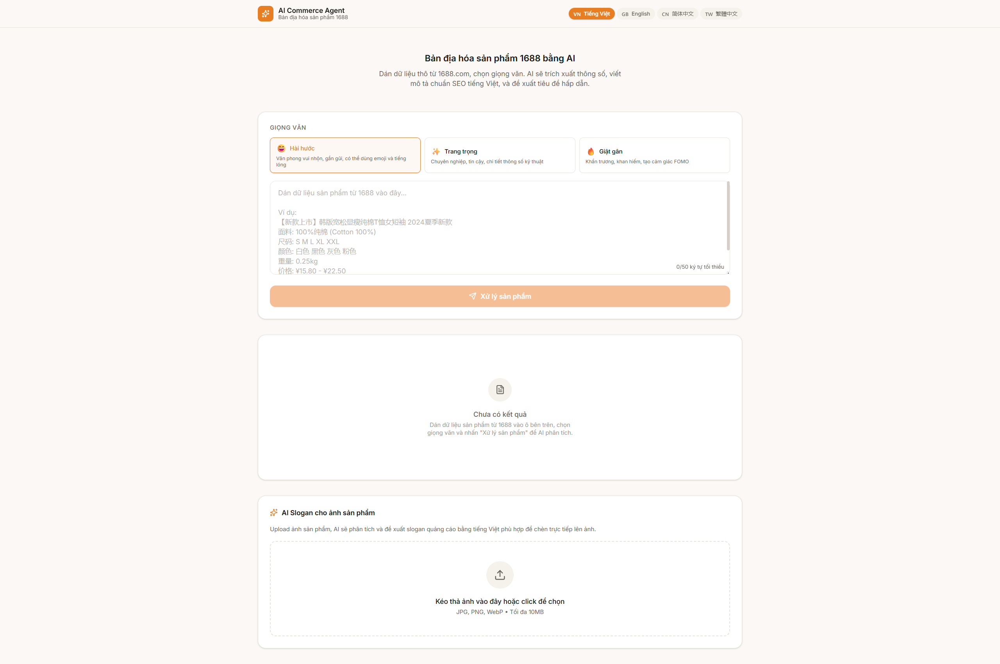
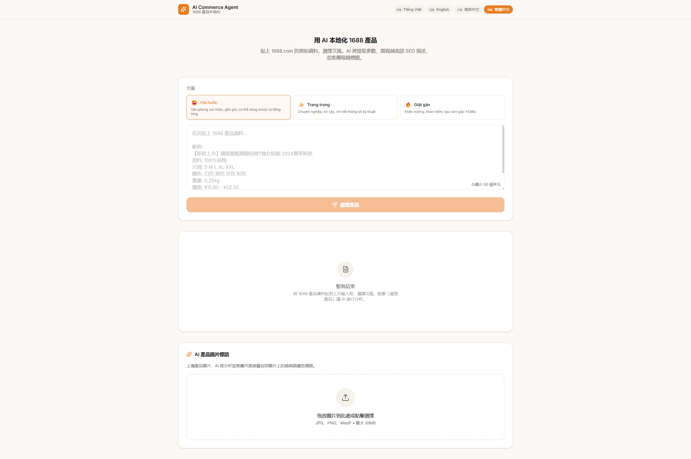

# 🚀 AI Commerce Agent — 1688 Product Localization

<div align="center">

**[🇬🇧 English](#english)** &nbsp;|&nbsp; **[🇻🇳 Tiếng Việt](#vietnamese)** &nbsp;|&nbsp; **[🇨🇳 简体中文](#simplified-chinese)** &nbsp;|&nbsp; **[🇹🇼 繁體中文](#traditional-chinese)**

> AI-powered tool that converts 1688.com product listings into Vietnamese e-commerce content (Shopee, TikTok Shop) — $0 operating cost.

### 🌐 Live Demo: [https://truongduy-ai-commerce.netlify.app/](https://truongduy-ai-commerce.netlify.app/)

[](https://nextjs.org/)
[](https://www.typescriptlang.org/)
[](https://tailwindcss.com/)
[](https://ai.google.dev/)
[]()
[](LICENSE)

</div>

## 📸 Preview / Ảnh chụp màn hình

| 🖥️ Input & Processing / Nhập liệu & Xử lý | 📋 Results & Output / Kết quả & Đầu ra |
|:---:|:---:|
|  |  |

> 💡 **Tip:** Paste raw 1688.com product data on the left → AI extracts specs, writes SEO descriptions & suggests catchy titles on the right.

---

<div align="center">

### 🌐 **[🇬🇧 English](#english)** &nbsp;|&nbsp; **[🇻🇳 Tiếng Việt](#vietnamese)** &nbsp;|&nbsp; **[🇨🇳 简体中文](#simplified-chinese)** &nbsp;|&nbsp; **[🇹🇼 繁體中文](#traditional-chinese)**

</div>

---

<a id="english"></a>

## 🇬🇧 English

### Overview

AI Commerce Agent is a web app that helps Vietnamese dropshippers localize 1688.com products. Paste raw Chinese product data → AI extracts specs, writes SEO-optimized Vietnamese descriptions, and suggests catchy titles — ready to copy-paste to Shopee or TikTok Shop.

### Key Features

| Feature | Description |
|---------|-------------|
| 🔄 **1688 Data Processing** | Paste raw product data → AI extracts specs, writes SEO descriptions, suggests titles |
| 🎨 **3 Writing Tones** | Humorous (TikTok/Shopee), Professional (premium brands), Sensational (FOMO marketing) |
| 🌐 **4 UI Languages** | Vietnamese, English, Simplified Chinese, Traditional Chinese |
| 🖼️ **AI Image Slogans** | Upload product image → Gemini Vision analysis → Vietnamese ad slogans |
| 📋 **One-Click Copy** | Independent copy buttons for each section |
| 📱 **Responsive** | Mobile, tablet, desktop optimized |
| 🌙 **Dark Mode** | Auto-follows system preference |
| 🔖 **Bookmarklet** | One-click data extraction from 1688 pages (no extension needed) |

### Architecture

```
┌──────────────────────────────────────────────────────┐
│                    Client (Browser)                   │
│  ┌──────────┐  ┌──────────┐  ┌──────────────────┐    │
│  │ Next.js  │  │ Tailwind │  │ Shadcn/UI        │    │
│  │ App Router│  │ CSS v4   │  │ Components       │    │
│  └──────────┘  └──────────┘  └──────────────────┘    │
├──────────────────────────────────────────────────────┤
│                    API Layer                          │
│  ┌──────────────────┐  ┌────────────────────────┐    │
│  │ /api/process     │  │ /api/analyze-image     │    │
│  │ (Text → Gemini)  │  │ (Image → Gemini Vision)│    │
│  └──────────────────┘  └────────────────────────┘    │
├──────────────────────────────────────────────────────┤
│                    AI Engine                          │
│  ┌──────────────────────────────────────────────┐    │
│  │         Google Gemini 1.5 Flash               │    │
│  │  • Custom System Prompt (TOCFL + Textile)     │    │
│  │  • 1,500 req/day (Free Tier)                  │    │
│  │  • Structured JSON Output                     │    │
│  └──────────────────────────────────────────────┘    │
├──────────────────────────────────────────────────────┤
│                    Deployment                         │
│  ┌──────────┐  ┌──────────┐  ┌──────────────┐       │
│  │ Vercel   │  │ Supabase │  │ Bookmarklet  │       │
│  │ (Free)   │  │ (Future) │  │ ($0 Crawler) │       │
│  └──────────┘  └──────────┘  └──────────────┘       │
└──────────────────────────────────────────────────────┘
```

### Tech Stack

| Layer | Technology | Why |
|-------|-----------|-----|
| Framework | Next.js 15 (App Router) | Server Actions, API Routes, Vercel deploy |
| Language | TypeScript (strict) | Type safety for AI-generated data |
| Styling | Tailwind CSS v4 | Utility-first, fast iteration |
| UI | Shadcn/UI + Lucide | Professional components, Tailwind v4 compatible |
| AI | Gemini 1.5 Flash | Free tier, best CN→VN translation quality |
| i18n | Custom React Context | Lightweight, 0 dependencies, full control |
| Deploy | Vercel (Free Tier) | $0 hosting, auto CI/CD |

### Project Structure

```
ai-commerce-agent/
├── public/
│   └── bookmarklet.js          # 1688 one-click extractor
├── src/
│   ├── app/
│   │   ├── layout.tsx          # Root layout + i18n Provider
│   │   ├── page.tsx            # Dashboard page
│   │   ├── globals.css         # Tailwind v4 + theme + RWD
│   │   └── api/
│   │       ├── process/        # POST: text processing
│   │       └── analyze-image/  # POST: image analysis
│   ├── components/
│   │   ├── dashboard/
│   │   │   ├── InputPanel.tsx      # Input area + tone selector
│   │   │   ├── OutputPanel.tsx     # Results display (Tabs)
│   │   │   ├── CopyButton.tsx      # One-click copy
│   │   │   ├── ToneSelector.tsx    # Writing tone picker
│   │   │   ├── LanguageSelector.tsx # UI language switcher
│   │   │   └── ImageUpload.tsx     # Image upload + slogan gen
│   │   └── layout/
│   │       └── Header.tsx
│   ├── hooks/
│   │   ├── useProcessText.ts
│   │   └── useAnalyzeImage.ts
│   └── lib/
│       ├── gemini.ts               # Gemini SDK wrapper
│       ├── prompts.ts              # System Prompt (TOCFL + Textile expertise)
│       ├── types.ts                # TypeScript type definitions
│       └── i18n/
│           ├── I18nContext.tsx      # i18n Provider
│           └── dictionaries.ts     # 4-language dictionaries
├── .env.local
├── next.config.ts
├── package.json
└── README.md
```

### Get Free Gemini API Key

1. Go to [Google AI Studio](https://aistudio.google.com/)
2. Sign in with Google account
3. Click "Get API Key"
4. Copy to `.env.local`

---

<a id="vietnamese"></a>
## 🇻🇳 Tiếng Việt

### Tổng Quan

AI Commerce Agent là web app giúp dropshipper Việt Nam bản địa hóa sản phẩm từ 1688.com. Dán dữ liệu thô tiếng Trung → AI trích xuất thông số, viết mô tả SEO tiếng Việt, đề xuất tiêu đề hấp dẫn — sẵn sàng copy-paste sang Shopee hoặc TikTok Shop.

### Tính Năng Chính

| Tính năng | Mô tả |
|-----------|-------|
| 🔄 **Xử lý dữ liệu 1688** | Dán dữ liệu thô → AI trích xuất thông số, viết mô tả SEO, đề xuất tiêu đề |
| 🎨 **3 Giọng Văn** | Hài hước (TikTok/Shopee), Trang trọng (thương hiệu cao cấp), Giật gân (FOMO) |
| 🌐 **4 Ngôn Ngữ Giao Diện** | Tiếng Việt, English, 简体中文, 繁體中文 |
| 🖼️ **AI Slogan Ảnh** | Upload ảnh sản phẩm → Gemini Vision phân tích → slogan quảng cáo tiếng Việt |
| 📋 **Copy Một Chạm** | Nút copy riêng cho từng phần |
| 📱 **Responsive** | Tối ưu mobile, tablet, desktop |
| 🌙 **Dark Mode** | Tự động theo hệ thống |
| 🔖 **Bookmarklet** | Một click trích xuất dữ liệu từ trang 1688 (không cần cài extension) |

### Kiến Trúc

```
┌──────────────────────────────────────────────────────┐
│                    Client (Browser)                   │
│  ┌──────────┐  ┌──────────┐  ┌──────────────────┐    │
│  │ Next.js  │  │ Tailwind │  │ Shadcn/UI        │    │
│  │ App Router│  │ CSS v4   │  │ Components       │    │
│  └──────────┘  └──────────┘  └──────────────────┘    │
├──────────────────────────────────────────────────────┤
│                    API Layer                          │
│  ┌──────────────────┐  ┌────────────────────────┐    │
│  │ /api/process     │  │ /api/analyze-image     │    │
│  │ (Text → Gemini)  │  │ (Image → Gemini Vision)│    │
│  └──────────────────┘  └────────────────────────┘    │
├──────────────────────────────────────────────────────┤
│                    AI Engine                          │
│  ┌──────────────────────────────────────────────┐    │
│  │         Google Gemini 1.5 Flash               │    │
│  │  • System Prompt tùy chỉnh (TOCFL + Dệt may) │    │
│  │  • 1,500 req/ngày (Free Tier)                │    │
│  │  • Output JSON có cấu trúc                   │    │
│  └──────────────────────────────────────────────┘    │
├──────────────────────────────────────────────────────┤
│                    Deployment                         │
│  ┌──────────┐  ┌──────────┐  ┌──────────────┐       │
│  │ Vercel   │  │ Supabase │  │ Bookmarklet  │       │
│  │ (Miễn phí)│  │ (Tương lai)│ │ (Crawler 0Đ) │       │
│  └──────────┘  └──────────┘  └──────────────┘       │
└──────────────────────────────────────────────────────┘
```

### Công Nghệ Sử Dụng

| Lớp | Công nghệ | Lý do |
|-----|----------|-------|
| Framework | Next.js 15 (App Router) | Server Actions, API Routes, deploy Vercel |
| Ngôn ngữ | TypeScript (strict) | Type safety cho dữ liệu AI |
| Styling | Tailwind CSS v4 | Utility-first, phát triển nhanh |
| UI | Shadcn/UI + Lucide | Component chuyên nghiệp, tương thích Tailwind v4 |
| AI | Gemini 1.5 Flash | Free tier, dịch Trung→Việt tốt nhất |
| i18n | Custom React Context | Nhẹ, 0 dependency, kiểm soát hoàn toàn |
| Deploy | Vercel (Free Tier) | Hosting 0Đ, CI/CD tự động |

---

<a id="simplified-chinese"></a>
## 🇨🇳 简体中文

### 概述

AI Commerce Agent 是一款帮助越南电商卖家将 1688.com 商品数据本地化的 Web 应用。粘贴中文原始数据 → AI 提取规格、撰写越南语 SEO 描述、推荐吸睛标题 — 即可复制粘贴到 Shopee 或 TikTok Shop。

### 核心功能

| 功能 | 说明 |
|------|------|
| 🔄 **1688 数据处理** | 粘贴原始数据 → AI 提取规格、撰写 SEO 描述、推荐标题 |
| 🎨 **3 种文风** | 幽默（TikTok/Shopee）、专业（高端品牌）、吸睛（FOMO 营销） |
| 🌐 **4 种界面语言** | 越南语、英语、简体中文、繁体中文 |
| 🖼️ **AI 图片标语** | 上传商品图片 → Gemini Vision 分析 → 越南语广告标语 |
| 📋 **一键复制** | 每个区块独立复制按钮 |
| 📱 **响应式设计** | 手机、平板、桌面完美适配 |
| 🌙 **深色模式** | 自动跟随系统主题 |
| 🔖 **Bookmarklet** | 一键从 1688 页面提取数据（无需安装扩展） |

### 架构

```
┌──────────────────────────────────────────────────────┐
│                    Client (Browser)                   │
│  ┌──────────┐  ┌──────────┐  ┌──────────────────┐    │
│  │ Next.js  │  │ Tailwind │  │ Shadcn/UI        │    │
│  │ App Router│  │ CSS v4   │  │ Components       │    │
│  └──────────┘  └──────────┘  └──────────────────┘    │
├──────────────────────────────────────────────────────┤
│                    API Layer                          │
│  ┌──────────────────┐  ┌────────────────────────┐    │
│  │ /api/process     │  │ /api/analyze-image     │    │
│  │ (文本 → Gemini)  │  │ (图片 → Gemini Vision) │    │
│  └──────────────────┘  └────────────────────────┘    │
├──────────────────────────────────────────────────────┤
│                    AI Engine                          │
│  ┌──────────────────────────────────────────────┐    │
│  │         Google Gemini 1.5 Flash               │    │
│  │  • 自定义 System Prompt（TOCFL + 纺织专业）  │    │
│  │  • 1,500 次/天（免费额度）                    │    │
│  │  • 结构化 JSON 输出                           │    │
│  └──────────────────────────────────────────────┘    │
├──────────────────────────────────────────────────────┤
│                    Deployment                         │
│  ┌──────────┐  ┌──────────┐  ┌──────────────┐       │
│  │ Vercel   │  │ Supabase │  │ Bookmarklet  │       │
│  │ (免费)   │  │ (未来)   │  │ (0元爬虫)    │       │
│  └──────────┘  └──────────┘  └──────────────┘       │
└──────────────────────────────────────────────────────┘
```

### 技术栈

| 层级 | 技术 | 原因 |
|------|------|------|
| 框架 | Next.js 15 (App Router) | Server Actions、API Routes、Vercel 一键部署 |
| 语言 | TypeScript (strict) | AI 生成数据的类型安全 |
| 样式 | Tailwind CSS v4 | Utility-first，快速迭代 |
| UI | Shadcn/UI + Lucide | 专业组件，Tailwind v4 兼容 |
| AI | Gemini 1.5 Flash | 免费额度充足，中译越质量最佳 |
| 国际化 | 自建 React Context | 轻量、零依赖、完全可控 |
| 部署 | Vercel (Free Tier) | 零成本托管，自动 CI/CD |

---

<a id="traditional-chinese"></a>
## 🇹🇼 繁體中文

### 概述

AI Commerce Agent 是一款幫助越南電商賣家將 1688.com 商品資料本地化的 Web 應用。貼上中文原始資料 → AI 提取規格、撰寫越南語 SEO 描述、推薦吸睛標題 — 即可複製貼上到 Shopee 或 TikTok Shop。

### 核心功能

| 功能 | 說明 |
|------|------|
| 🔄 **1688 資料處理** | 貼上原始資料 → AI 提取規格、撰寫 SEO 描述、推薦標題 |
| 🎨 **3 種文風** | 幽默（TikTok/Shopee）、專業（高端品牌）、吸睛（FOMO 行銷） |
| 🌐 **4 種介面語言** | 越南語、英語、簡體中文、繁體中文 |
| 🖼️ **AI 圖片標語** | 上傳商品圖片 → Gemini Vision 分析 → 越南語廣告標語 |
| 📋 **一鍵複製** | 每個區塊獨立複製按鈕 |
| 📱 **響應式設計** | 手機、平板、桌面完美適配 |
| 🌙 **深色模式** | 自動跟隨系統主題 |
| 🔖 **Bookmarklet** | 一鍵從 1688 頁面擷取資料（無需安裝擴充功能） |

### 架構

```
┌──────────────────────────────────────────────────────┐
│                    Client (Browser)                   │
│  ┌──────────┐  ┌──────────┐  ┌──────────────────┐    │
│  │ Next.js  │  │ Tailwind │  │ Shadcn/UI        │    │
│  │ App Router│  │ CSS v4   │  │ Components       │    │
│  └──────────┘  └──────────┘  └──────────────────┘    │
├──────────────────────────────────────────────────────┤
│                    API Layer                          │
│  ┌──────────────────┐  ┌────────────────────────┐    │
│  │ /api/process     │  │ /api/analyze-image     │    │
│  │ (文本 → Gemini)  │  │ (圖片 → Gemini Vision) │    │
│  └──────────────────┘  └────────────────────────┘    │
├──────────────────────────────────────────────────────┤
│                    AI Engine                          │
│  ┌──────────────────────────────────────────────┐    │
│  │         Google Gemini 1.5 Flash               │    │
│  │  • 自訂 System Prompt（TOCFL + 紡織專業）    │    │
│  │  • 1,500 次/天（免費額度）                    │    │
│  │  • 結構化 JSON 輸出                           │    │
│  └──────────────────────────────────────────────┘    │
├──────────────────────────────────────────────────────┤
│                    Deployment                         │
│  ┌──────────┐  ┌──────────┐  ┌──────────────┐       │
│  │ Vercel   │  │ Supabase │  │ Bookmarklet  │       │
│  │ (免費)   │  │ (未來)   │  │ (0元爬蟲)    │       │
│  └──────────┘  └──────────┘  └──────────────┘       │
└──────────────────────────────────────────────────────┘
```

### 技術棧

| 層級 | 技術 | 原因 |
|------|------|------|
| 框架 | Next.js 15 (App Router) | Server Actions、API Routes、Vercel 一鍵部署 |
| 語言 | TypeScript (strict) | AI 生成資料的型別安全 |
| 樣式 | Tailwind CSS v4 | Utility-first，快速迭代 |
| UI | Shadcn/UI + Lucide | 專業元件，Tailwind v4 相容 |
| AI | Gemini 1.5 Flash | 免費額度充足，中譯越品質最佳 |
| 國際化 | 自建 React Context | 輕量、零依賴、完全可控 |
| 部署 | Vercel (Free Tier) | 零成本託管，自動 CI/CD |

---

## 👨‍💻 About the Author

**Nguyễn Duy** — Aspiring Computer Science graduate student applying to Taiwan universities.

- 🇹🇼 **TOCFL Advanced** (Band A / HSK 6 equivalent) Chinese proficiency
- 🏭 **2 years in textile manufacturing** — statistics & production management
- 💻 **Full-stack development** — Next.js, TypeScript, AI integration
- 🎯 **Target**: Taiwan CS Master's Program, Fall 2026

### Why This Project Stands Out

The core competitive advantage isn't the code — it's the **System Prompt**:

- Built-in **30+ textile terminology glossary** (Chinese→Vietnamese, curated from real industry experience)
- Translation rules designed with **TOCFL Advanced Chinese proficiency**
- **3 Vietnamese e-commerce writing tones** optimized for Shopee & TikTok Shop

This is **domain knowledge** that cannot be replicated by generic AI tools.

---

Built with ❤️ using Next.js 15, Tailwind CSS v4, Gemini 1.5 Flash — May 2026

